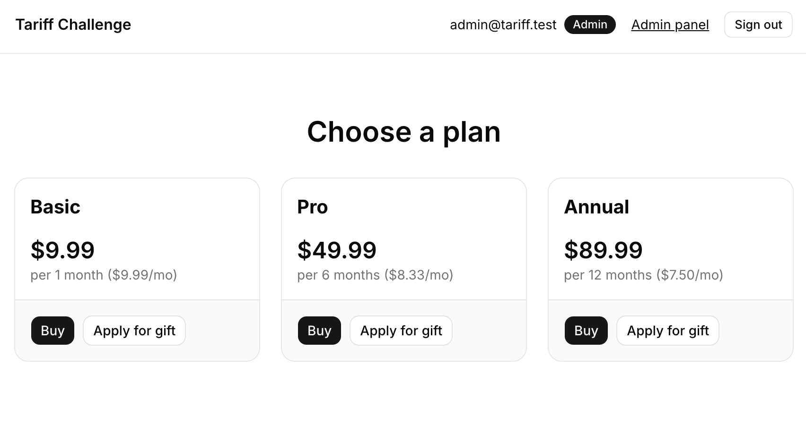

# Tariff Gift Approval App

A Next.js + Supabase app where users can mock-buy a tariff plan or apply for a free gift. Gift applications are approved or rejected by an admin via a Telegram bot. Approved users receive an email with an activation code to unlock access.

**Live demo:** https://tariff-challenge.vercel.app



---

## Test admin credentials

| Field    | Value               |
| -------- | ------------------- |
| Email    | `admin@tariff.test` |
| Password | `admin123`          |

---

## Setup

### 1. Clone the repo

```bash
git clone <repo-url>
cd tariff-challenge
```

### 2. Install dependencies

```bash
npm install
```

### 3. Configure environment variables

```bash
cp .env.local.example .env.local
```

Fill in `.env.local`:

| Variable                        | Where to get it                                              |
| ------------------------------- | ------------------------------------------------------------ |
| `NEXT_PUBLIC_SUPABASE_URL`      | Supabase project → Settings → API → Project URL             |
| `NEXT_PUBLIC_SUPABASE_ANON_KEY` | Supabase project → Settings → API → anon key                |
| `SUPABASE_SERVICE_ROLE_KEY`     | Supabase project → Settings → API → service_role key        |
| `NEXT_PUBLIC_APP_URL`           | `http://localhost:3000` for local dev                        |
| `SMTP_USER`                     | Your Gmail address                                           |
| `SMTP_PASS`                     | Gmail → Google Account → Security → App Passwords            |

### 4. Create a Supabase project

1. Go to [supabase.com](https://supabase.com) and create a new project.
2. In the SQL editor, run each migration file **in order** from `supabase/migrations/`:
   - `001_profiles.sql`
   - `002_tariffs.sql`
   - `003_gift_applications.sql`
   - `004_user_access.sql`
   - `005_telegram_config.sql`
   - `006_notification_logs.sql`
   - `007_triggers.sql`
   - `008_rls.sql`

### 5. Enable Google OAuth

1. In the Supabase dashboard go to **Authentication → Providers → Google**.
2. Enable Google and fill in your OAuth client ID and secret (from Google Cloud Console).
3. Add `http://localhost:3000/api/auth/callback` to the allowed redirect URLs in **Authentication → URL Configuration**.

### 6. Create the admin user

1. In Supabase → **Authentication → Users**, create a new user with email/password.
2. In the **Table Editor → profiles**, find that user's row and set `role = 'admin'`.

### 7. Add tariff plans

1. Log in at `/admin/login` with the admin credentials.
2. Go to **Tariffs** and create at least one plan (name, price, period in months).

### 8. Run the dev server

```bash
npm run dev
```

Open [http://localhost:3000](http://localhost:3000).

---

## Telegram bot setup

1. Open Telegram and message **@BotFather**.
2. Send `/newbot` and follow the prompts. Copy the **bot token** you receive.
3. Log in to the admin panel at `/admin/login`.
4. Go to **Telegram bot** and paste the bot token, then click **Save**.
   - This registers the webhook automatically at `{NEXT_PUBLIC_APP_URL}/api/telegram/webhook`.
5. Find your new bot in Telegram and press **Start**.
   - The webhook captures your chat ID and marks the bot as connected.
6. The admin panel will show **Bot connected**.

> The webhook URL must be publicly reachable. For local development, use a tunnel like [ngrok](https://ngrok.com): `ngrok http 3000`, then set `NEXT_PUBLIC_APP_URL` to the ngrok HTTPS URL and re-save the bot token to re-register the webhook.

---

## How to test the full gift flow

1. **Sign in as a regular user** — go to `/` and click **Apply for gift** on any tariff card. You'll be redirected to sign in with Google.
2. **Apply for a gift** — after sign in you're redirected back; click **Apply for gift** again to submit the application.
3. **Admin receives a Telegram message** — the bot sends a message to the admin with **Approve** and **Reject** inline buttons.
4. **Admin approves** — tap **Approve** in Telegram (or go to `/admin/gifts` and click Approve from the panel).
5. **User receives an email** — the activation code is sent to the user's email address.
6. **User activates** — go to `/activate`, enter the code from the email.
7. **Success page** — user is redirected to `/success` and sees the page confirming active access.
8. **Notification logs** — go to `/admin/notifications` to see the full audit trail of Telegram and email sends.
